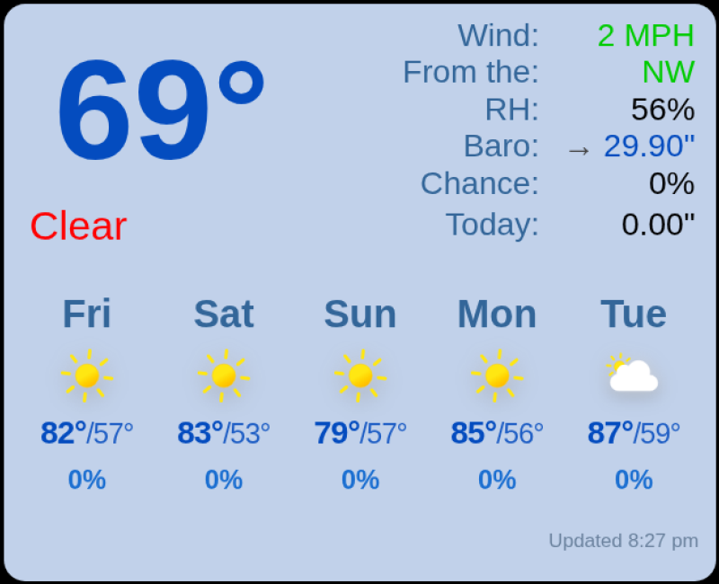
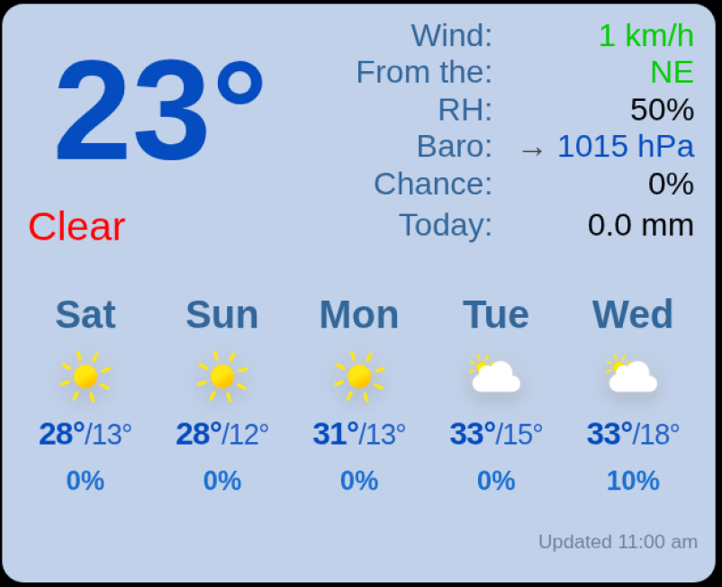

# MMM-TempestWeather

A MagicMirror² weather module for WeatherFlow Tempest owners, combining real-time observations from your personal weather station with current conditions and a configurable forecast.

### Imperial



### Metric



## Features

* Real-time temperature from the Tempest WebSocket feed
* Wind speed and direction
* Relative humidity
* Barometric pressure and pressure trend
* Daily precipitation probability
* Daily precipitation accumulation
* Current weather conditions
* Configurable 1–7 day forecast
* Weather icons
* Imperial and metric unit support
* Automatic WebSocket reconnection
* Connection watchdog for stale observations
* Automatic forecast updates

## Status

**Stable — Version 1.2.1**

MMM-TempestWeather is running on a Raspberry Pi-based MagicMirror² installation and has been tested with live data from a WeatherFlow Tempest weather station.

Both imperial and metric display modes have been tested with live Tempest data.

## Requirements

* MagicMirror²
* WeatherFlow Tempest weather station
* WeatherFlow personal access token
* Tempest device ID
* Tempest station ID
* Internet connection
* A Node.js version that provides built-in `fetch` and `WebSocket`

No additional npm packages are required.

The WeatherFlow credentials identify your Tempest station and authorize access to its data. See the WeatherFlow/Tempest API documentation for current information about API access and credentials.

Do not publish your personal WeatherFlow access token.

## Installation

From your MagicMirror `modules` directory:

```bash
cd ~/MagicMirror/modules
git clone https://github.com/dwburger/MMM-TempestWeather.git
```

No `npm install` step is required.

The module directory will contain:

```text
MMM-TempestWeather/
├── MMM-TempestWeather.js
├── MMM-TempestWeather.css
├── node_helper.js
├── README.md
├── LICENSE
└── screenshots/
    ├── MMM-TempestWeather.png
    └── MMM-TempestWeather-Metric.png
```

## Configuration

Add the following entry to the `modules` array in:

```text
~/MagicMirror/config/config.js
```

Example:

```javascript
{
    module: "MMM-TempestWeather",
    position: "top_right",
    config: {
        token: "YOUR_WEATHERFLOW_TOKEN",
        deviceId: "YOUR_TEMPEST_DEVICE_ID",
        stationId: "YOUR_TEMPEST_STATION_ID",
        units: "imperial"
    }
},
```

Restart MagicMirror after saving the configuration.

Do not place your actual WeatherFlow token in a public Git repository.

## Unit Systems

MMM-TempestWeather supports both imperial and metric units.

For imperial units:

```javascript
units: "imperial"
```

Imperial mode displays:

* Temperature in °F
* Wind speed in MPH
* Barometric pressure in inHg
* Precipitation in inches

For metric units:

```javascript
units: "metric"
```

Metric mode displays:

* Temperature in °C
* Wind speed in km/h
* Barometric pressure in hPa
* Precipitation in mm

If the `units` option is omitted, the module defaults to imperial units.

## Configuration Options

### `token`

Your WeatherFlow personal access token.

**Required.**

### `deviceId`

The device ID of your Tempest weather station.

**Required.**

### `stationId`

The station ID used for WeatherFlow forecast data.

**Required.**

### `units`

Selects the unit system used by the module.

Available values:

```text
imperial
metric
```

Default:

```text
imperial
```

Imperial mode uses °F, MPH, inHg, and inches.

Metric mode uses °C, km/h, hPa, and mm.

### `updateInterval`

How often forecast data is refreshed.

Default:

```text
60000
```

This is 60 seconds.

### `observationTimeout`

How long the module will wait without receiving a Tempest observation before treating the WebSocket connection as stale.

Default:

```text
180000
```

This is 3 minutes.

### `initialConnectionTimeout`

How long the module will wait for the first Tempest observation after establishing a connection before reconnecting.

Default:

```text
180000
```

This is 3 minutes.

### `watchdogInterval`

How often the node helper checks the health of the Tempest WebSocket connection.

Default:

```text
60000
```

This is 60 seconds.

### `maxReconnectDelay`

Maximum delay between WebSocket reconnection attempts.

Default:

```text
60000
```

This is 60 seconds.

### `forecastDays`

Number of forecast days displayed.

Accepted range:

```text
1-7
```

Values greater than 7 are automatically limited to 7.

Default:

```text
5
```

## Architecture

MMM-TempestWeather uses the standard MagicMirror frontend/node-helper architecture.

### `MMM-TempestWeather.js`

The browser-side module is responsible for:

* Building the dashboard display
* Receiving weather data from `node_helper.js`
* Formatting current observations
* Applying the selected unit system
* Processing forecast data for display
* Selecting weather icons
* Updating the MagicMirror DOM

### `node_helper.js`

The Node.js helper is responsible for:

* Connecting to the WeatherFlow WebSocket service
* Receiving real-time Tempest observations
* Requesting WeatherFlow Better Forecast data using the selected unit system
* Managing forecast update intervals
* Detecting stale WebSocket observations
* Automatically reconnecting the WebSocket
* Applying exponential reconnect delays
* Preventing overlapping forecast requests
* Timing out stalled forecast requests

The frontend and node helper communicate using MagicMirror socket notifications.

## Data Sources

MMM-TempestWeather uses two WeatherFlow data sources:

* The WeatherFlow WebSocket service for real-time Tempest observations
* The WeatherFlow Better Forecast REST service for forecast and current-condition information

Weather icons are provided by the Meteocons weather icon set.

Use of WeatherFlow data and services is subject to WeatherFlow's applicable terms and licensing.

## Reliability

The module includes:

* WebSocket reconnection
* Exponential reconnect delay
* Observation timeout detection
* Initial connection timeout detection
* Connection watchdog
* Forecast request timeout
* Protection against overlapping forecast requests
* Basic validation of incoming weather observations

## Styling

The appearance of the module is controlled by:

```text
MMM-TempestWeather.css
```

The default layout is designed for a **400 × 325 pixel** weather panel.

The CSS can be modified to better match an individual MagicMirror layout.

## Version History

### 1.2.1

Version 1.2.1 limits the configurable forecast display to seven days.

Changes include:

* Supports `forecastDays` values from 1 through 7
* Limits values greater than 7 to 7
* Keeps the default forecast length at 5 days

### 1.2

Version 1.2 adds user-selectable imperial and metric units.

Changes include:

* Adds the `units` configuration option
* Supports `imperial` and `metric` unit systems
* Defaults to imperial units for backward compatibility
* Displays imperial temperature in °F and metric temperature in °C
* Displays imperial wind speed in MPH and metric wind speed in km/h
* Displays imperial barometric pressure in inHg and metric pressure in hPa
* Displays imperial precipitation in inches and metric precipitation in mm
* Requests Better Forecast data using the selected unit system
* Preserves the Version 1.1 display and behavior when using imperial units

### 1.1

Version 1.1 moves WeatherFlow network communication from the browser-side MagicMirror module into `node_helper.js`.

Changes include:

* Moves the WeatherFlow WebSocket connection to `node_helper.js`
* Moves Better Forecast REST requests to `node_helper.js`
* Keeps display rendering and forecast formatting in the frontend module
* Uses MagicMirror socket notifications for communication between the frontend and node helper
* Preserves the appearance and behavior of Version 1.0
* Requires no additional npm packages on supported Node.js versions

### 1.0

Initial standalone release.

The module was extracted from a working Tempest dashboard previously embedded in MagicMirror using MMM-Widget.

Version 1.0 kept the WeatherFlow REST and WebSocket networking in the browser-side module to preserve the behavior of the original implementation during extraction.

## License

MMM-TempestWeather is released under the **MIT License**.

Copyright (c) 2026 D.W. Burger

See the `LICENSE` file for details.